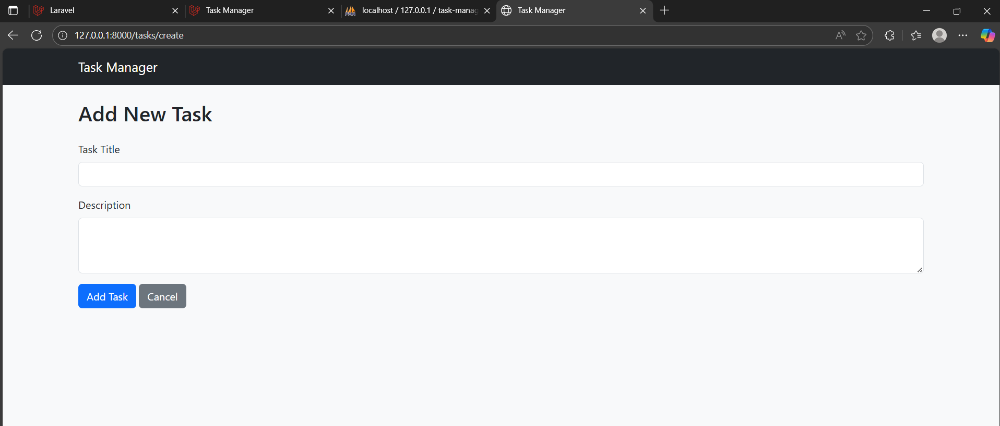
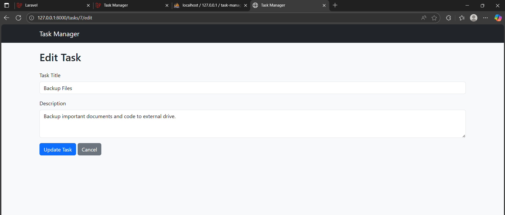
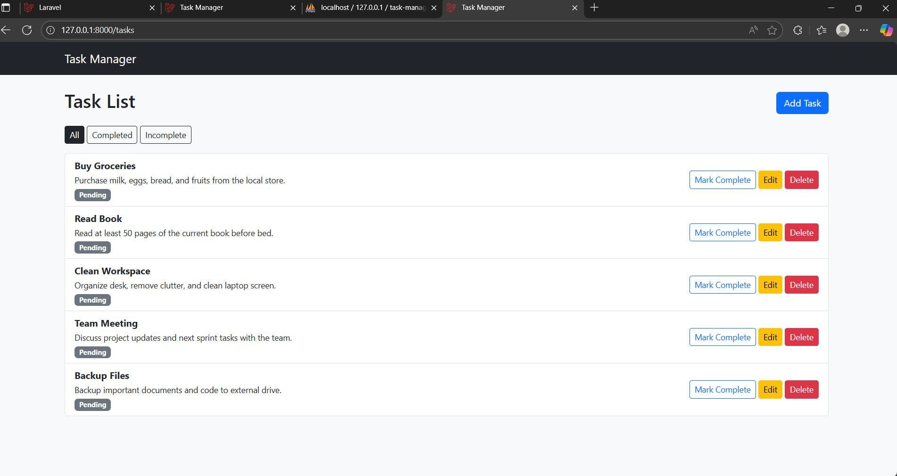

# Task Manager

A simple **Task Manager** web application built with **Laravel** that allows users to create, manage, and toggle tasks efficiently. This project includes automated tests using **PHPUnit** to ensure functionality.

---

## Features

- Create tasks with a title and status.
- Toggle tasks between completed and not completed.
- Position-based task ordering.
- Automated testing for core functionalities using PHPUnit.

---

## Quick Start

Follow these steps to see Task Manager in action quickly:

1. **Clone the repository and set up dependencies**
bash
git clone https://github.com/your-username/task-manager.git
cd task-manager
composer install
npm install
npm run dev
cp .env.example .env
Configure your database in .env

ini
Copy code
DB_CONNECTION=mysql
DB_HOST=127.0.0.1
DB_PORT=3306
DB_DATABASE=task_manager
DB_USERNAME=root
DB_PASSWORD=your_password
Run migrations and seed data

bash
Copy code
php artisan key:generate
php artisan migrate
php artisan db:seed
Serve the application

bash
Copy code
php artisan serve
Open http://localhost:8000 in your browser.

Screenshots / Demo
Create Task:

Toggle Task Status:

Task List Ordering:

(Replace the above images/GIFs with actual ones from your app.)

Running Tests
Automated tests are included to ensure all functionalities work correctly:

bash
Copy code
php artisan test
You should see all tests passing if the setup is correct.

Technologies Used
PHP 8.x

Laravel 10.x

MySQL

PHPUnit

Composer & NPM

Project Structure
app/Models – Eloquent models (e.g., Task.php)

app/Http/Controllers – Controllers for handling requests

database/migrations – Database schema definitions

tests/Feature – Feature tests for application functionality

tests/Unit – Unit tests for smaller components

Contributing
Feel free to fork the repository and submit pull requests. Ensure tests pass before submitting changes.

### Screenshots / Demo
Create Task Page: 
  
*This screenshot shows how to add a new task with title and status.*

**Edit Task Page:**  
  
*This screenshot shows how to update an existing task.*

**Task List / Index Page:**  
  
*This screenshot shows all tasks, their status, and position-based ordering.*
